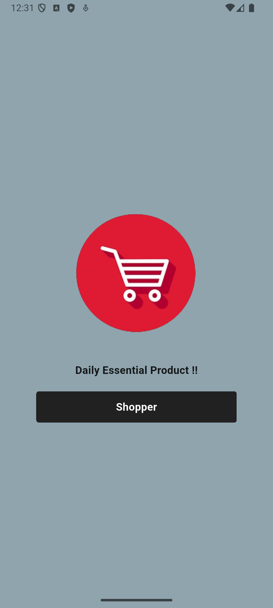
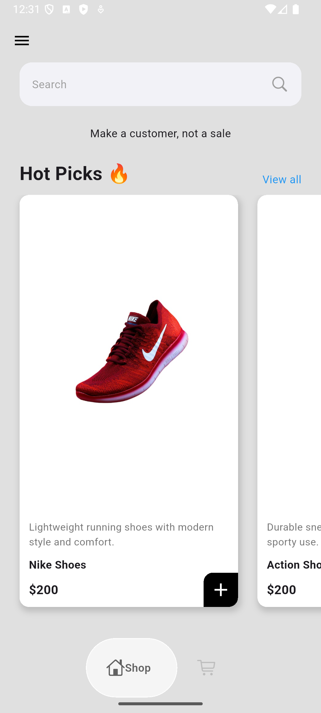
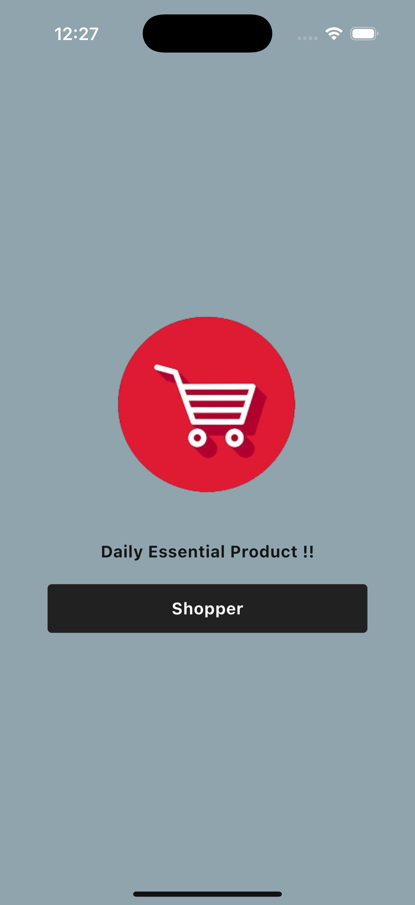

# flutterapp

A new Flutter project.

## Getting Started

This project is a starting point for a Flutter application.

A few resources to get you started if this is your first Flutter project:

- [Lab: Write your first Flutter app](https://docs.flutter.dev/get-started/codelab)
- [Cookbook: Useful Flutter samples](https://docs.flutter.dev/cookbook)

For help getting started with Flutter development, view the
[online documentation](https://docs.flutter.dev/), which offers tutorials,
samples, guidance on mobile development, and a full API reference.

  <!-- Android Section -->
  

    <h3>📱 Android Screenshots</h3>
    

      
      
    

  

  <!-- iOS Section -->
  

    <h3>🍏 iOS Screenshots</h3>
    

      
      
    

  

